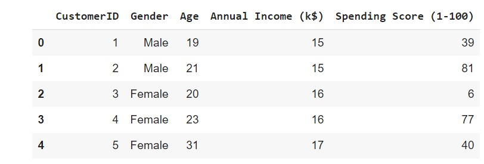
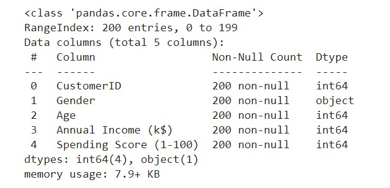
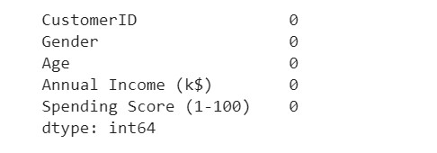
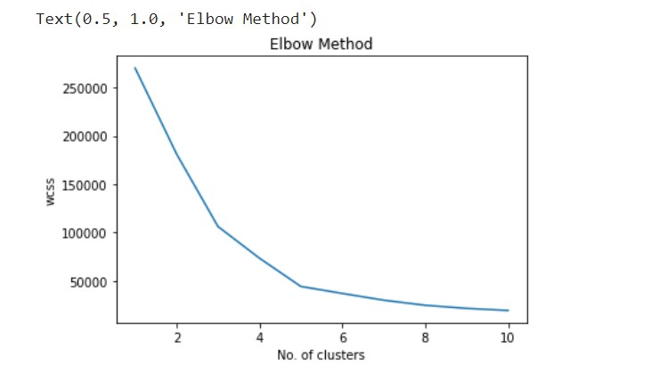
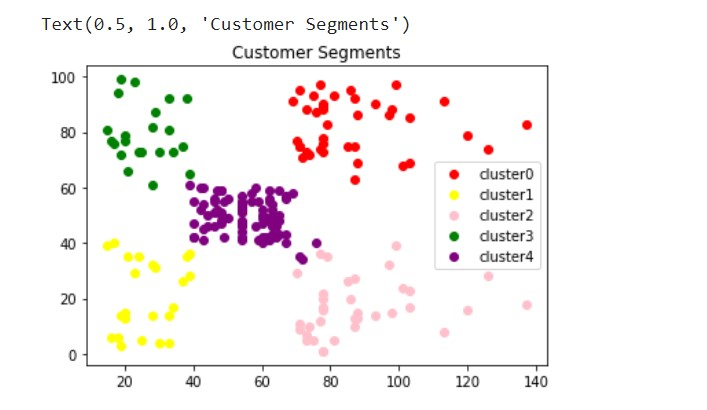

# Implementation-of-K-Means-Clustering-for-Customer-Segmentation

## AIM:
To write a program to implement the K Means Clustering for Customer Segmentation.

## Equipments Required:
1. Hardware – PCs
2. Anaconda – Python 3.7 Installation / Moodle-Code Runner

## Algorithm
1. Import the necessary packages using import statement.
2. Read the given csv file using read_csv() method and print the number of contents to be displayed using df.head().
3. Import KMeans and use for loop to cluster the data.
4. Predict the cluster and plot data graphs
5. Print the output and end the program.


## Program:
```
/*
Program to implement the K Means Clustering for Customer Segmentation.
Developed by: RAJESHKANNAN M
RegisterNumber:  212221230081
*/
import pandas as pd
import matplotlib.pyplot as plt
data = pd.read_csv("Mall_Customers.csv")
data.head(
data.info())
data.isnull().sum()
from sklearn.cluster import KMeans
wcss = []
for i in range(1,11):
    kmeans = KMeans(n_clusters = i,init = "k-means++")
    kmeans.fit(data.iloc[:,3:])
    wcss.append(kmeans.inertia_)
plt.plot(range(1,11),wcss)
plt.xlabel("No. of Clusters")
plt.ylabel("wcss")
plt.title("Elbow Method")
km = KMeans(n_clusters = 5)
km.fit(data.iloc[:,3:])
y_pred = km.predict(data.iloc[:,3:])
data["cluster"] = y_pred
df0 = data[data["cluster"]==0]
df1 = data[data["cluster"]==1]
df2 = data[data["cluster"]==2]
df3 = data[data["cluster"]==3]
df4 = data[data["cluster"]==4]
plt.scatter(df0["Annual Income (k$)"],df0["Spending Score (1-100)"],c="red",label="cluster0")
plt.scatter(df1["Annual Income (k$)"],df1["Spending Score (1-100)"],c="yellow",label="cluster1")
plt.scatter(df2["Annual Income (k$)"],df2["Spending Score (1-100)"],c="pink",label="cluster2")
plt.scatter(df3["Annual Income (k$)"],df3["Spending Score (1-100)"],c="green",label="cluster3")
plt.scatter(df4["Annual Income (k$)"],df4["Spending Score (1-100)"],c="purple",label="cluster4")
plt.legend()
plt.title("Customer Segments")
```

## Output:
# Read data:

# Data info:


# Checking null data:


# PLOT-ELBOW METHODS:


# CLUSTER:



## Result:
Thus the program to implement the K Means Clustering for Customer Segmentation is written and verified using python programming.
